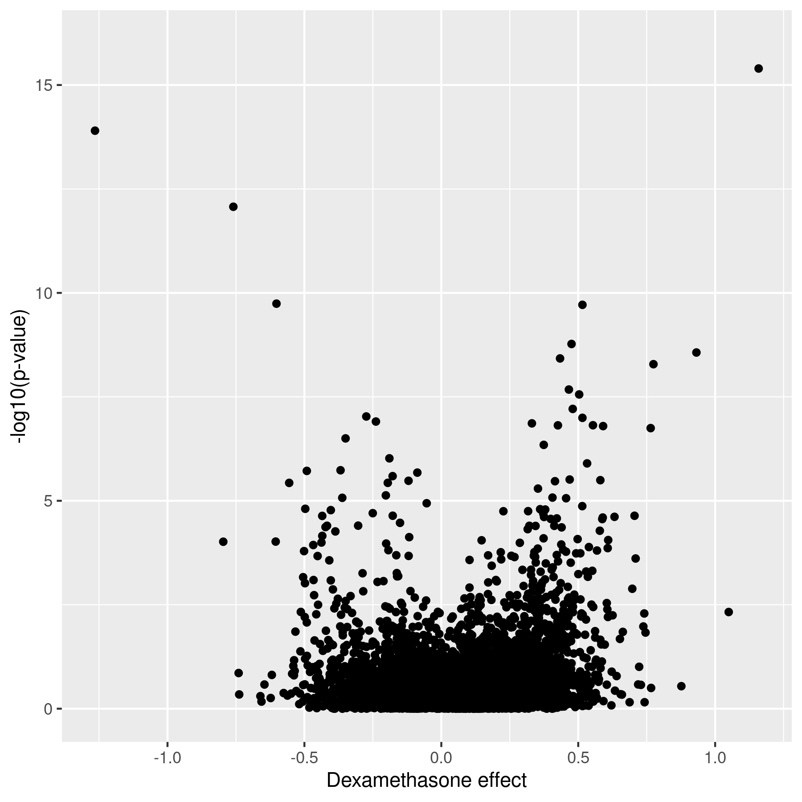
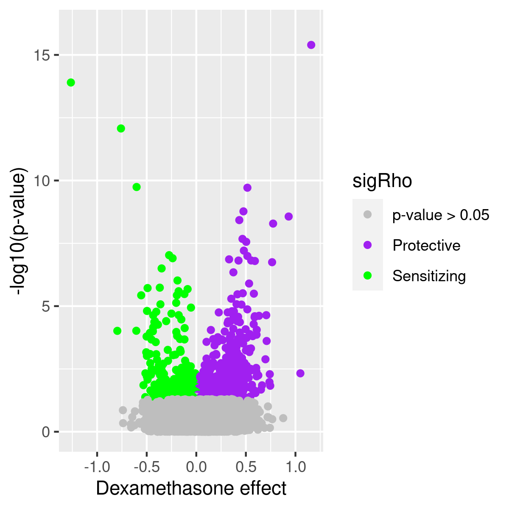
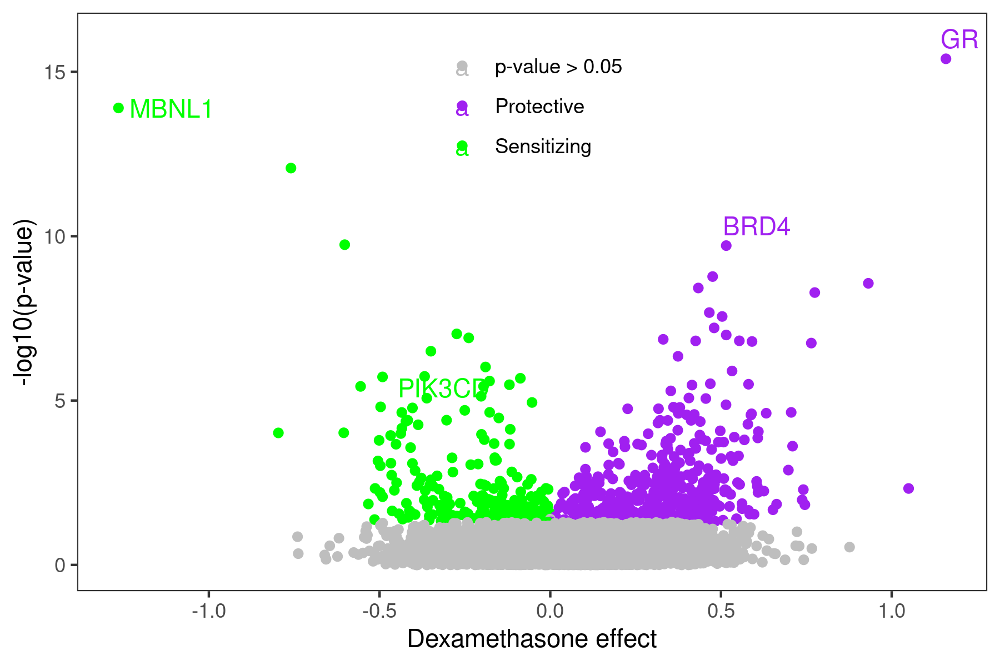

# Suppression of B-cell development genes is key to glucocorticoid efficacy in treatment of acute lymphoblastic leukemia

[GitHub URL for this project](https://github.com/Intro-Sci-Comp-UIowa/biol-4386-course-project-zimmermanjo)

## Reference

Karina A. Kruth, Mimi Fang, Dawne N. Shelton, Ossama Abu-Halawa, Ryan Mahling, Hongxing Yang, Jonathan S. Weissman, Mignon L. Loh, Markus Müschen, Sarah K. Tasian, Michael C. Bassik, Martin Kampmann, Miles A. Pufall; Suppression of B-cell development genes is key to glucocorticoid efficacy in treatment of acute lymphoblastic leukemia. Blood 2017; 129 (22): 3000–3008. doi: https://doi.org/10.1182/blood-2017-02-766204

## Introduction

B-cell acute lymphoblastic leukemia (B-ALL) is the most common childhood cancer, and glucocorticoids are a key component of chemotherapy regimens for B-ALL. Patients with B-ALL who have a poor response to glucocorticoids have poorer outcomes. Additionally, glucocorticoids are used at high doses which lead to many off target toxicities. Glucocorticoids work through the glucocorticoid receptor, which is a ligand activated transcription factor that regulates genes leading to B-ALL cell death. The specific genes and pathways which lead to glucocorticoid resistance are not entirely known. A systematic, genome-wide short hairpin RNA (shRNA) screen was performed by Kruth et al, to identify genes affecting glucocorticoid sensitivity. By maintaining at least 1000 cells per shRNA at all times and aiming for an infection rate of no more than 30%, cells were infected with one shRNA per cell. This allows a single gene to be knocked down per cell, and therefore the the effect of each gene on glucocorticoid sensitivity can be quantified. This process identified hundreds of genes which contribute to glucocorticoid-induced cell death. Many of the genes which increase glucocorticoid-induced cell death, also called sensitizing genes, fall in the B-cell receptor pathway, including PIK3CD. These sensitizing genes are of particular interest in the treatment of B-ALL. If we can identify genes which are mainly expressed in lymphocytes and also sensitize cells to glucocorticoids when they are knocked down, we could 1) improve response of resistant B-ALL to glucocorticoid therapy, and 2) attempt to reduce the glucocorticoid doses used to limit toxicities without sacrificing anti-leukemia efficacy.

## Figure to Reproduce

I plan to reproduce figure 2B from the Kruth et al. paper: 

In this figure, the x-axis represents the phenotype of gene knock down on dexamethasone sensitivity (aka Rho phenotype). A Rho phenotype of 0 would indicate that the gene knock down has no effect on dexamethasone sensitivity. More negative Rho phenotypes (to the left on the figure) indicate increasing sensitivity to dexamethasone with gene knock down, and more positive Rho phenotypes (to the right on the figure) indicate increasing resistance to dexamethasone with gene knock down.

## Materials and Methods
### Data Source
The data for this figure was produced after infecting B-ALL cells with shRNAs against genes associated with cancer, apoptosis, gene expression, and kinases, with one gene knocked down per cell. Infected cells were then subjected to dexamethasone treatment or vehicle control treatment. At the end of treatment, the shRNAs are sequenced and the frequency of each individual shRNA is compared between cell types. First, the shRNA frequencies in the growth control cells are compared to the shRNA frequencies in infected cells which were cryopreserved at the beginning of the treatment period to determine the growth phenotype. Then the shRNA frequencies in the dexamethasone treated cells are compared to the shRNA frequencies in the growth control cells, with the growth phenotype removed to determine the dexamethasone sensitivity (Rho phenotype). P values for the Rho phenotype are calculated by both the Mann-Whitney U test and K-S test, but the P values in figure 2B are the Mann-Whitney P values. The P values were previously computed using Python scripts available from <https://kampmannlab.ucsf.edu/resources> (GImap in the Bioinformatics section). These phenotypes and P values are available from the electronic version of the article in xslx format (Document 3 of supplemental data) at <https://ashpublications.org/blood/article/129/22/3000/36066/Suppression-of-B-cell-development-genes-is-key-to?searchresult=1>. 

### RStudio Set Up
I am using RStudio on the FastX environment for easy connection to my GitHub repository. Before starting to re-create the figure, I installed `tidyverse`, which includes the `ggplot2` package, along with the `readxl` and `ggrepel` packages. 

I uploaded the xslx file into the RStudio environment after downloading to my project data folder (downloaded on 2/23/2021 as described above) and viewed the table to ensure that the correct data was populated, specifically Rho phenotype (the effect on dexamethasone sensitivity) and Rho P value (the previously calculated p values for the phenotype for each gene knock down using Mann-Whitney U test). 

### Modifying the Data Prior to Plotting
In order to plot the data as it appears in the figure, I used the `mutate` function to change the Rho p-values to the -log10(p-value). I then created a new dataframe with this new variable added. The Rho phenotypes do not require modification prior to plotting. 

I also needed to create two additional variables in the dataframe to complete the figure. First, I designated each gene in the dataframe as sensitizing (Rho Phenotype <0 and Rho P value < 0.05), protective (Rho Phenotype >0 and Rho P value < 0.05), or insignificant (p-value > 0.05). I also created an additional variable for the key genes to be labeled in the figure. I set all genes to NA as default in this variable and then changed the 4 key genes (NR3C1, MBNL1, PIK3CD, BRD4) to be labeled with the gene name on the plot (with NR3C1 changed to GR for glucocorticoid receptor on the plot). 

### Script for Creating Volcano Plots
Complete R script for each interval and final figure can be found in the analysis README.md in [GitHub](https://github.com/Intro-Sci-Comp-UIowa/biol-4386-course-project-zimmermanjo/tree/main/analysis)

## Results and Discussion
### Initial Draft of the Volcano Plot
Using the `ggplot2` package, I created a scatterplot using `geom_point` with the Rho phenotype on the x-axis and the -log10(p-value) on the y-axis. I modified the y-axis limits and the y-axis label to match the original figure. I also changed the x-axis label to "Dexamethasone effect". This produced an initial volcano plot which appears to be a black and white version of the oringial figure (Figure 2). 

### Adding Color to the Volcano Plot
Using the designations I created for each gene (sensitizing, protective, or p-value > 0.05), I added color to the volcano plot with this variable as the color. To change the colors to the original figure color scheme of green for sensitizing, purple for protective, and gray for p > 0.05, I created a vector with these colors and assigned the names to the colors. Using `color_scale_manual`, I then colored the plot with this color scheme (Figure 3). 

### Adding Key Gene Labels
There are 4 key genes labeled in the original figure, NR3C1 (which is labeled as GR for glucocorticoid receptor), MBNL1, BRD4, and PIK3CD. I used the additional variable I created to add labels to these genes, which added the labels to these data points but not in the desired final position as seen in the original figure. I adjusted these positions in a later step.

### Changing the Themes
The initial plot that I made had the default gray background, but the original figure has a white background with no grid marks. Using `theme_bw()`, `panel.grid.major`, and `panel.grid.minor`, I was able to change the background to match the original figure. I also used the theme function to move the legend position to the top middle of the plot and remove the title from the legend (Figure 4). 

 

### Adjustments to Key Gene Label Positioning, Key Gene Point Size, and Legend
To move the labels for the 4 key genes, I used `geom_text_repel` to move the labels away from data points. This worked for MBNL1, BRD4, and GR, but PIK3CD was still overlapping with other data points. I added additional arguments to this using `nudge_x` and `nudge_y` along with `ifelse` statements to move the PIK3CD label separately from the other 3 labels. This allowed me to move PIK3CD farther to the left and away from other data points. Using another `ifelse` statement, I was able to adjust the size of the point for each of these genes to be larger than the non-labeled genes, similar to the original figure. I made one other adjustment to the legend to remove the letters which were overlying the points using `guide_legend` to produce the final version of my replicated figure (Figure 5). 

![Final volcano plot replicating figure 2B from Kruth et al. Genes labeled in green are those that significantly increase sensitivity to dexamethasone when knocked down and genes labeled in purple are those that significantly protect ALL cells from glucocorticoid induced cell death when knocked down. The most sensitizing hit was MBNL1 and the most protective hit was the glucocorticoid receptor. PIK3CD was another notable sensitizing gene, which encodes the lymphocyte-restricted phosphatidylinositol-4,5-bisphosphate 3-kinase catalytic subunit delta (PIK3-delta).](./output/final_plot.png)   

The two main differences remaining between this figure and the original are the positions of the labels for MBNL1, BRD4, and GR relative to the points and the x-axis label. Both of these differences are easily modifiable using Adobe Illustrator after the plot is created, and this is likely how they were done prior to publication.

## Conclusion
Genome-wide shRNA knock down effectively identified hundreds of genes with the potential to increase glucocorticoid sensitivity of B-ALL cells. By selectively inhibiting genes which are more specifically expressed in B-ALL cells, such as PIK3CD, we may be able to improve the anti-leukemia effect of glucocorticoids in B-ALL which is resistant to glucocorticoids. We can also attempt to give lower doses of glucocorticoids with PI3K-delta inhibitors, such as idelalisib, to maintain the anti-leukemia effect in sensitive B-ALL cells while decreasing the systemic toxicities of the therapy. 

## Reflection
With the help of the Software Carpentry R workshop, resources from [RStudio](https://rstudio.com), a helpful [introduction to volcano plots in R](https://biocorecrg.github.io/CRG_RIntroduction/volcano-plots.html), and additional Googling along the way, I was able to successfully reproduce a figure which is very close to the original. There was a lot of trial and error, but by making several plots along the way, I was able to break down the task into smaller components and learn how each piece of the code functioned in making the final plot. 

In terms of the reproducibility of this figure, it was fairly straightforward to make using the provided phenotypes and p-values once I learned how to code in R. However, if I had wanted to start with the original shRNA reads and calculate the p-values myself, I would not have been able to do so with the data available. I am currently performing a similar shRNA screen of my own, so in the near future I will be able to perform this part of the analysis on my own data using the python scripts from the Kampmann lab. This class has taught me the basics of working with the command line, which will be helpful for using the python scripts, and after this project, I now know the steps needed to plug in new screen data and create this type of volcano plot again. 
