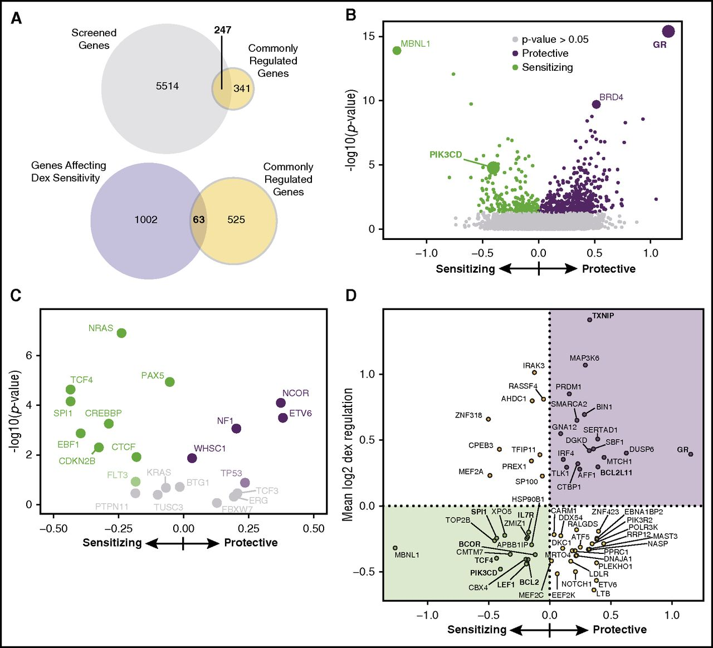

# Suppression of B-cell development genes is key to glucocorticoid efficacy in treatment of acute lymphoblastic leukemia

## Reference

Karina A. Kruth, Mimi Fang, Dawne N. Shelton, Ossama Abu-Halawa, Ryan Mahling, Hongxing Yang, Jonathan S. Weissman, Mignon L. Loh, Markus Müschen, Sarah K. Tasian, Michael C. Bassik, Martin Kampmann, Miles A. Pufall; Suppression of B-cell development genes is key to glucocorticoid efficacy in treatment of acute lymphoblastic leukemia. Blood 2017; 129 (22): 3000–3008. doi: https://doi.org/10.1182/blood-2017-02-766204

## Introduction

B-cell acute lymphoblastic leukemia (B-ALL) is the most common childhood cancer, and glucocorticoids are a key component of chemotherapy regimens for B-ALL. Patients with B-ALL who have a poor response to glucocorticoids have poorer outcomes. Additionally, glucocorticoids are used at high doses which lead to many off target toxicities. Glucocorticoids work through the glucocorticoid receptor, which is a ligand activated transcription factor that regulates genes leading to B-ALL cell death. The specific genes and pathways which lead to glucocorticoid resistance are not entirely known. A systematic, genome-wide short hairpin RNA (shRNA) screen was performed by Kruth et al, which knocked down one gene per cell and allowed quantification of the effect of each gene on glucocorticoid sensitivity. This process identified hundreds of genes which contribute to glucocorticoid-induced cell death. Many of the genes which increase glucocorticoid-induced cell death fall in the B-cell receptor pathway, including PIK3CD. 

## Figure to Reproduce

I plan to reproduce figure 2B from the Kruth et al. paper: 

## Materials and Methods
### Data Source
The data for this figure was produced after infecting B-ALL cells with shRNAs against genes associated with cancer, apoptosis, gene expression, and kinases, with one gene knocked down per cell. Infected cells were then subjected to dexamethasone treatment or vehicle control treatment. At the end of treatment, the shRNAs are sequenced and the frequency of each individual shRNA is compared between the dexamethasone treated cells and the vehicle treated cells which serve as a growth control. P values for the dexamethasone sensitivity phenotype are calculated by both the Mann-Whitney U test and K-S test. The P values were previously computed using Python scripts available from <https://kampmannlab.ucsf.edu/resources> (GImap in the Bioinformatics section). These phenotypes and P values are available from the electronic version of the article in xslx format (Document 3 of supplemental data) at <https://ashpublications.org/blood/article/129/22/3000/36066/Suppression-of-B-cell-development-genes-is-key-to?searchresult=1>. 

### RStudio Set Up
I have already downloaded RStudio, but I have also found RStudio on the FastX environment to use and connect to my remote GitHub repository. I installed tidyverse, which includes the ggplot2 package, along with the readxl and knitr packages. 

I uploaded the xslx file into the RStudio environment after downloading to my project data folder (downloaded on 2/23/2021 as described above) and viewed the table to ensure that the correct data was populated, specifically Rho phenotype (the effect on dexamethasone sensitivity) and Rho P value (the previously calculated p values for the phenotype for each gene knock down). 

### Preparing Data for Graphing
Prior to graphing, I will need to set thresholds for significant phenotypes, which would be equivalent to p value <=0.05. The Rho P values will need to be transformed and graphed on the -log10 axis. The Rho phenotypes are calculated using the GImap scripts so do not need to be transformed further. I will also need to set thresholds for protective (phenotype > 0) and sensitizing (phenotype < 0).   

### Making the Volcano Plot
Using the ggplot2 package, I will make the volcano plot with the -log10 p-value on the y-axis and the dexamethasone sensitivity phenotype on the x-axis. After the plot is made, I can change the colors to indicate genes which significantly increase dexamethasone sensitivity when knocked down (green) and genes which significantly increase dexamethasone resistance when knocked down (purple) based on my previously set thresholds. I can then attempt to label the same significant genes as shown in the figure with names (GR, BRD4, PIK3CD, and MBNL1) and add the key to the figure.
 
## Reflections
My progress in reproducing the figure has been much slower than I had hoped. With no previous R background, I have been watching webinars and referring to the RStudio cheatsheets available at <https://rstudio.com> to get started. I also found a reference specifically on volcano plots using ggplot at <https://biocorecrg.github.io/CRG_RIntroduction/volcano-plots.html> that I hope will be helpful to my progress. 
